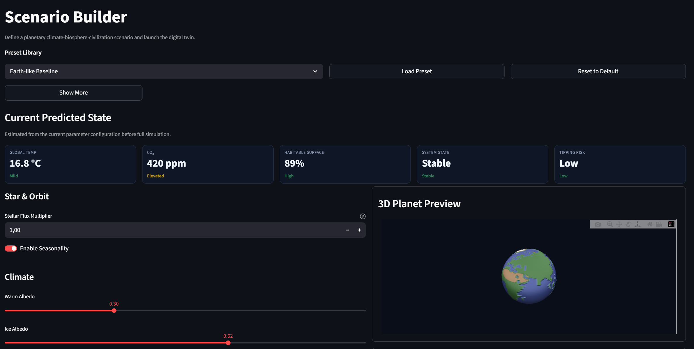
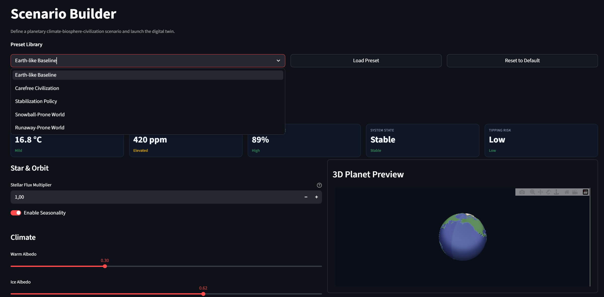
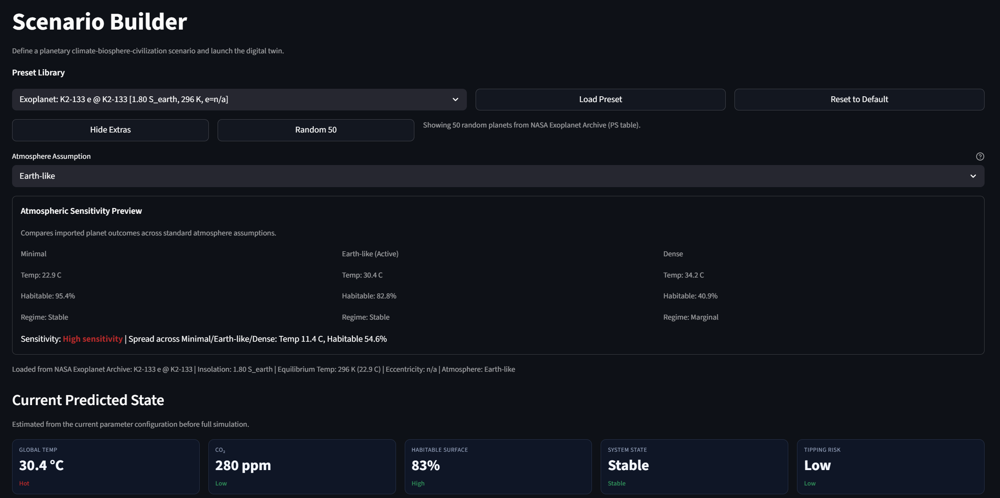
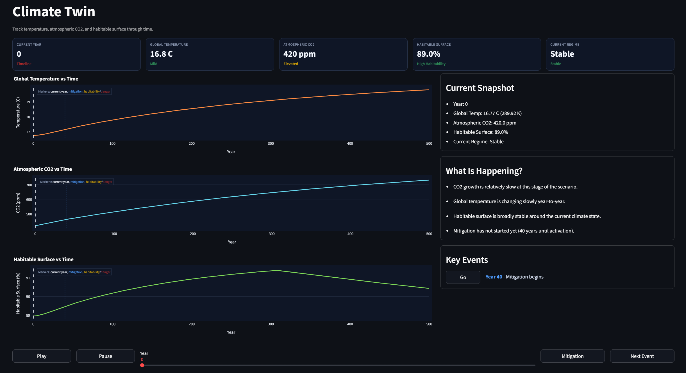
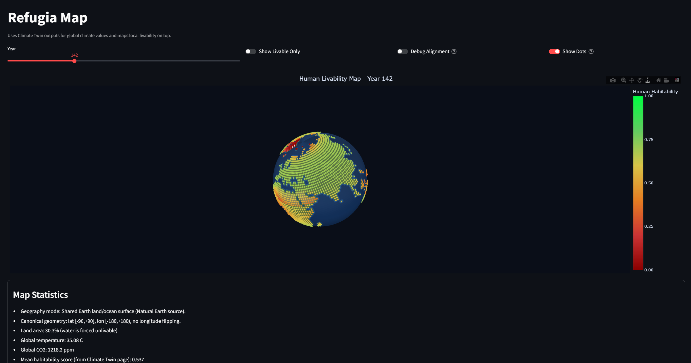
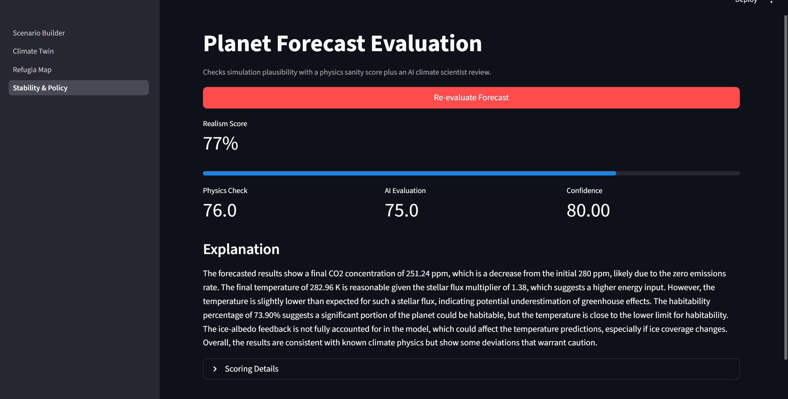

# Habitat Tipping Points

Interactive Streamlit application for exploring climate tipping risks on Earth-like and exoplanet scenarios.  
The app combines scenario design, time-series simulation, spatial habitability mapping, and AI-assisted interpretation of forecast realism.

## What the app includes

- **Scenario Builder**: configure star, atmosphere, civilization, and habitability assumptions; preview KPIs; inspect a 3D planet.
- **Climate Twin**: simulate global temperature, CO2, and habitable surface through time with key timeline events.
- **Refugia Map**: map local habitability across the planet surface using Climate Twin outputs.
- **Planet Forecast Evaluation**: evaluate final-state realism using physics checks plus an AI climate-scientist-style review.

### 0) Scenario Builder Overview


### 1) Scenario Builder main presets


### 2) Scenario Builder exoplanet mode


### 3) Climate Twin


### 4) Refugia Map


### 5) Forecast Evaluation and AI-Assisted Review


## Quick start

### 1) Install dependencies

```bash
python -m venv .venv
# Windows PowerShell
.venv\Scripts\Activate.ps1
pip install -r requirements.txt
pip install openai python-dotenv
```

`openai` and `python-dotenv` are required for the **Planet Forecast Evaluation** page and the batch evaluation script.

### 2) Configure environment

Create `token.env` in the project root:

```env
AI=your_openai_api_key_here
OPENAI_MODEL=gpt-4o-mini
```

### 3) Run the app

```bash
streamlit run app.py
```

### 4) Run tests

```bash
pytest -q
```

## Project structure

```text
app.py                          # Streamlit navigation entry point
pages/                          # App pages (builder, twin, map, evaluation)
htp/model/                      # Core climate model, simulation, IO, schema
htp/scenarios/                  # Presets and NASA exoplanet import helpers
htp/ui/                         # Shared UI helpers/components
tests/                          # Unit/integration tests
average_chat_percentage.py      # Batch realism evaluation script
```

## Model references

- Myhre, G. et al. (1998). *New estimates of radiative forcing due to well mixed greenhouse gases*. Geophysical Research Letters. https://doi.org/10.1029/98GL01908
- IPCC AR5 WGI (2013), Chapter 8 Supplementary Material (Myhre-style logarithmic CO2 forcing context). https://www.ipcc.ch/site/assets/uploads/2018/07/WGI_AR5.Chap_.8_SM.pdf
- Budyko, M. I. (1969). *The effect of solar radiation variations on the climate of the Earth*. Tellus. https://doi.org/10.1111/j.2153-3490.1969.tb00466.x
- North, G. R. (1975). *Theory of Energy-Balance Climate Models*. Journal of the Atmospheric Sciences. https://doi.org/10.1175/1520-0469(1975)032<2033:TOEBCM>2.0.CO;2
- NASA Exoplanet Archive TAP docs. https://exoplanetarchive.ipac.caltech.edu/docs/TAP/usingTAP.html

## Model Equations, Heuristics, and Update Rules

This section summarizes the equations currently implemented in the codebase (`htp/model/*` and map/evaluation pages).

### 1) Core climate and radiative balance

These equations form a reduced-order climate core and include both physics-inspired terms and calibrated stabilizing heuristics.

- Logistic helper:
  - $\sigma(x) = \frac{1}{1 + e^{-x}}$

- Ice-warm albedo blend:
  - $w_{ice} = \frac{1}{1 + \exp\left(\frac{T - T_{ice}}{w}\right)}$
  - $\alpha(T) = \alpha_{warm}(1 - w_{ice}) + \alpha_{ice} w_{ice}$

- CO2 forcing parameterization:
  - $F_{CO2} = K_{CO2} \ln\left(\frac{\max(C, C_{min})}{C_0}\right)$

- Calibrated equilibrium temperature proxy:
  - $I_{cold} = \sigma\left(\frac{6 - T}{4}\right)$
  - $A_{contrast} = \mathrm{clamp}\left(\frac{\alpha_{ice} - \alpha_{warm} - 0.18}{0.45}, 0, 1\right)$
  - $L_{flux} = \mathrm{clamp}\left(\frac{1 - S}{0.22}, 0, 1\right)$
  - $F_{lock} = 6.5 \cdot I_{cold} \cdot (0.55 A_{contrast} + 0.45 L_{flux})$
  - $T_{eq} = T_{ref} + K_{flux}(S-1) - K_{albedo}(\alpha - \alpha_{ref}) + F_{CO2} - F_{lock}$

- Relaxation dynamics:
  - $CS = \mathrm{clamp}\left(\frac{8 - T}{20}, 0, 1\right)$
  - $\tau_{eff} = \tau \cdot (1 + 1.40 \cdot CS \cdot A_{contrast})$
  - $T_{next} = T + (T_{eq} - T)\frac{\Delta t}{\tau_{eff}} - \Delta T_{coldtrap}$

- Extra cold-trap cooling (active for $T < 9^\circ C$):
  - $CS_9 = \mathrm{clamp}\left(\frac{9 - T}{30}, 0, 1\right)$
  - $E_{CO2} = \mathrm{clamp}\left(\frac{C - C_0}{1500}, 0, 1\right)$
  - $P = 1 - 0.40 E_{CO2}$
  - $\Delta T_{coldtrap} = 0.40 \cdot CS_9 \cdot (0.65A_{contrast} + 0.35L_{flux}) \cdot P$

### 2) Carbon cycle and atmospheric evolution

- Weathering sink:
  - $W = k_w \left(\frac{C}{C_0}\right)\exp(\beta(T - T_{ref}))$
  - Exponent is clamped in implementation for stability.

- Biosphere sink:
  - $B_T = \exp\left(-\frac{(T-T_{opt})^2}{2\sigma_T^2}\right)$
  - $B_A = \mathrm{clamp}\left(\frac{H-30}{30}, 0, 1\right)$
  - $B = k_b \left(\frac{C}{C_0}\right) B_T B_A$

- heuristic atmospheric relaxation term used in natural-planet mode:
  - $R_{atm} = \frac{C_{base} - C}{\tau_{atm}}$

- CO2 ODE and update:
  - $\frac{dC}{dt} = E_{human,eff} + V_{nat} - W - B + R_{atm}$
  - $C_{next} = \mathrm{clamp}(C + \frac{dC}{dt}\Delta t,\; C_{min}, C_{max})$

- IImported-world greenhouse proxy term (used only when atmospheric composition is unknown):
  - $\Delta T_{imp} = \mathrm{clamp}\left(\max(0,\lambda_{imp} \cdot K_{CO2}\ln(C/C_{base,imp})),\;0,\Delta T_{max}\right)$

### 3) Latitudinal and local habitability

- Latitudinal profile:
  - $T(\phi) = T_g + A_{eq}\cos^2\phi - A_{pol}\sin^2\phi + T_{season}$
  - $T_{season} = 0.8\sin(2\pi \cdot phase)\sin\phi$ (when seasonality enabled)

- Calibrated latitudinal shape terms:
  - $A_{eq} = \mathrm{clamp}(4.8 + 1.05H_{hot} - 0.08H_{cold} + 6S_{amp}, 2.5, 18)$
  - $A_{pol} = \mathrm{clamp}(20 + 0.55H_{cold} + 0.65H_{hot} + 6\max(0,\alpha_{ice}-\alpha_{warm}-0.20) + 12S_{amp}, 12, 42)$
  - $H_{hot}=\max(0, T_g-22)$, $H_{cold}=\max(0, 8-T_g)$

- Soft habitability from temperature:
  - $h_{low} = \sigma\left(\frac{T-T_{min}}{m}\right)$
  - $h_{high} = \sigma\left(\frac{T_{max}-T}{m}\right)$
  - $h = h_{low} \cdot h_{high}$

- Area-weighted habitable fraction:
  - $H_{global} = 100 \cdot \frac{\sum_\phi \cos\phi \cdot h(\phi)}{\sum_\phi \cos\phi}$

- Global climate stress penalty:
  - $S = \mathrm{clamp}(0.23S_{hot}+0.14S_{cold}+0.18S_{CO2}+0.10S_{spread}+0.18S_{comfort}, 0, 0.50)$
  - Where each component is normalized and clamped in code.

- Heuristic local climate downscaling for map rendering:
  - $T_{local} = T_{lat\_interp} + \mu_{micro} - L_{elev} + \Delta T_{class}$
  - $L_{elev} = 4.3\cdot \mathrm{clip}(z,0,4.5) + 0.7\cdot \mathrm{clip}(z,-1,0)$
  - $\Delta T_{class}$: desert $+3.8^\circ C$, snow/ice $-8.5^\circ C$, vegetated $+0.2^\circ C$

- Local human-habitability score:
  - $score = temp\_score \cdot (1 - S)$
  - Oceans are forced to 0 in the map rendering pipeline.

### 4) Civilization-emissions coupling

Civilization is modeled as a fragile societal layer on top of climate, rather than as a physical climate variable.

- Smoothstep:
  - $smoothstep(x)=t^2(3-2t)$, $t=\mathrm{clamp}(x,0,1)$

- Civilization survival:
  - $C_{civ} = \mathrm{clamp}(S_T(T) \cdot S_H(H), 0, 1)$
  - $S_T$: piecewise with smooth transitions on $[-10,0]^\circ C$ and $[30,40]^\circ C$
  - $S_H$: 0 below 30%, linear to 1 at 60%+

- Emissions modes (before survival scaling):
  - Growing: $E = E_0(1 + 0.010y)$
  - Carefree: $E = E_0 \frac{1+0.018y}{1+0.0012y}$
  - Stabilization (post-start): exponential decay with rate $0.035 \cdot \max(0.1,m)$
  - Aggressive mitigation (post-start): exponential decay with rate $0.065 \cdot \max(0.2,m)$
  - Additional mitigation multiplier for Constant/Growing/Carefree after start:
    - $\times \max(0.05,\;1 - 0.85m)$

- Effective emissions:
  - $E_{human,eff} = E_{human,base} \cdot C_{civ}$
  - In natural-planet mode, $C_{civ}=0$.

### 5) Earth map and geometry formulas

Planetary map rendering uses heuristic elevation, microclimate, and biome masks to project Climate Twin results onto a spherical surface.

### 6) Forecast realism physics check

This score is a lightweight consistency diagnostic, not a formal validation metric.

- Reference equilibrium estimate:
  - $T_{exp} = 255 \cdot S^{1/4}$

- Temperature error:
  - $\Delta T = |T_{final} - T_{exp}|$

- Heuristic consistency score:
  - $Score_{phys} = 10000 \cdot \exp\left(-(\Delta T/15)^2\right)$

---

Notes:
- `clamp(x,a,b)` means clipping to `[a,b]`.
- Several equations are intentionally heuristic/calibrated for an interactive simulator, not a full GCM.
